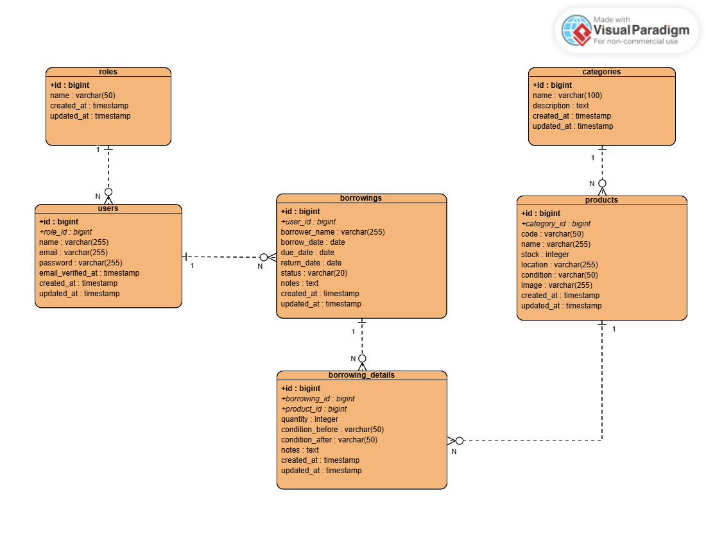

# Inventra - Inventory Management System

Inventra adalah aplikasi manajemen inventaris berbasis web yang dibuat untuk membantu pengelolaan data barang, kategori, stok, peminjaman, pengembalian, laporan, dan notifikasi stok menipis.

Aplikasi ini dibangun menggunakan Laravel, Blade, Tailwind CSS, PostgreSQL Supabase, Supabase Storage, dan REST API berbasis Laravel Sanctum.

---

## Deskripsi Project

Inventra dirancang untuk kebutuhan pengelolaan inventaris yang memiliki proses utama berupa pencatatan barang, pengelompokan kategori, peminjaman barang, pengembalian barang, pelaporan aktivitas inventaris, serta pemantauan stok barang yang mulai menipis.

Sistem ini mendukung pembagian hak akses berdasarkan role, sehingga setiap pengguna hanya dapat mengakses fitur sesuai tanggung jawabnya.

---

## Fitur Utama

### Autentikasi Pengguna

- Register pengguna baru
- Login
- Logout
- Forgot password
- Reset password melalui email
- Update profil
- Update password
- Hapus akun

Inventra menggunakan sistem autentikasi berbasis Laravel Breeze.

Fitur autentikasi yang tersedia:

- Login
- Register
- Logout
- Profile management
- Forgot password
- Reset password
- Email validation restriction
- Auto logout karena tidak aktif

Jika pengguna tidak aktif selama 30 menit, sistem akan otomatis logout dan mengarahkan pengguna ke halaman login. Pesan yang ditampilkan:
"Sesi Anda telah berakhir. Silakan masuk kembali."

### Email Registration Restriction

Registrasi publik hanya mengizinkan email dengan domain `@gmail.com`.

Jika pengguna mencoba register menggunakan email selain `@gmail.com`, sistem akan menampilkan pesan:

"Harap gunakan email valid @gmail.com."

### Manajemen Role

Inventra memiliki tiga role utama:

| Role | Hak Akses |
|---|---|
| Admin | Dashboard, kategori, barang, peminjaman, laporan, profil |
| Staff | Dashboard, kategori, barang, peminjaman, profil |
| Manager | Dashboard, laporan, profil |

### Dashboard Inventaris

- Ringkasan jumlah jenis barang
- Ringkasan stok tersedia
- Ringkasan barang yang sedang dipinjam
- Ringkasan transaksi selesai
- Grafik peminjaman bulanan
- Peminjaman terbaru
- Aksi cepat
- Notifikasi stok menipis
- Dark mode

### Manajemen Kategori

- Menampilkan daftar kategori
- Mencari kategori
- Menambah kategori
- Mengedit kategori
- Menghapus kategori
- Validasi agar kategori yang masih memiliki barang tidak dapat dihapus

### Detail Kategori
Inventra menyediakan halaman detail kategori untuk membantu pengguna melihat barang berdasarkan kategori tertentu.

Pada halaman detail kategori, pengguna dapat melihat:

- Nama kategori
- Deskripsi kategori
- Jumlah barang dalam kategori
- Total stok tersedia
- Jumlah barang dengan stok menipis
- Daftar barang yang termasuk dalam kategori tersebut

Setiap barang pada halaman detail kategori dapat diklik dan akan mengarahkan pengguna ke halaman detail barang.

### Manajemen Barang

- Menampilkan daftar barang
- Mencari barang berdasarkan kode, nama, kategori, lokasi, dan kondisi
- Menambah barang
- Mengedit barang
- Melihat detail barang
- Menghapus barang
- Upload gambar barang ke Supabase Storage
- Filter barang stok menipis
- Status stok menipis berdasarkan batas minimum stok

### Model Stok Barang

Inventra membedakan stok berdasarkan kondisi fisik barang:

- Stok siap dipinjam
- Barang sedang dipinjam
- Rusak ringan
- Rusak berat
- Maintenance
- Total fisik barang
- Batas stok minimum

Dengan model ini, satu jenis barang dapat memiliki beberapa unit fisik dengan kondisi yang berbeda.

### Manajemen Peminjaman

- Menampilkan riwayat peminjaman
- Mencari peminjaman berdasarkan peminjam, barang, kode barang, status, dan keterlambatan
- Menambah peminjaman
- Mengurangi stok otomatis saat barang dipinjam
- Melihat detail peminjaman
- Mengembalikan barang
- Mengatur kondisi barang setelah dikembalikan
- Menambah stok sesuai kondisi pengembalian

### Pengembalian Barang

Saat barang dikembalikan, sistem akan mengubah stok berdasarkan kondisi akhir:

| Kondisi Setelah Dikembalikan | Dampak pada Stok |
|---|---|
| Baik | Menambah stok siap dipinjam |
| Rusak Ringan | Menambah stok rusak ringan |
| Rusak Berat | Menambah stok rusak berat |
| Maintenance | Menambah stok maintenance |

### Laporan Inventaris

- Ringkasan jumlah barang
- Ringkasan stok tersedia
- Ringkasan barang dipinjam
- Ringkasan total peminjaman
- Ringkasan keterlambatan
- Ringkasan transaksi selesai
- Grafik peminjaman bulanan
- Distribusi status peminjaman
- Daftar barang stok menipis
- Filter laporan berdasarkan tanggal dan status
- Cetak laporan sebagai PDF
- Export laporan sebagai CSV yang dapat dibuka di Excel

### Notifikasi Stok Menipis

- Icon notifikasi di dashboard
- Popup notifikasi stok menipis
- Menampilkan daftar barang dengan stok siap dipinjam yang sudah mencapai batas minimum
- Link langsung ke detail barang stok menipis

### Dark Mode

- Dashboard
- Kategori
- Barang
- Peminjaman
- Laporan
- Profile
- Tabel dan card sudah disesuaikan agar tetap terbaca pada dark mode

### REST API

Inventra menyediakan REST API untuk kebutuhan integrasi dengan aplikasi lain seperti mobile app, frontend terpisah, dashboard eksternal, scanner barcode, atau sistem otomasi.

Autentikasi API menggunakan Laravel Sanctum dengan Bearer Token.

### Fitur Tambahan

- Detail kategori untuk melihat daftar barang berdasarkan kategori tertentu.
- Navigasi dari detail kategori langsung ke halaman detail barang.
- Splash screen pada halaman login dengan animasi logo dan teks penyambut.
- Pembatasan registrasi hanya untuk email dengan domain `@gmail.com`.
- Pengecualian akun demo untuk kebutuhan pengujian sistem:
  - `admin@example.com`
  - `staff@example.com`
  - `manager@example.com`
- Auto logout setelah 30 menit tidak ada aktivitas.
- Pesan notifikasi saat sesi pengguna berakhir karena tidak aktif.

---

## Teknologi yang Digunakan

| Teknologi | Fungsi |
|---|---|
| Laravel | Backend framework |
| Blade | Template engine |
| Tailwind CSS | Styling UI |
| Vite | Asset bundler |
| PostgreSQL Supabase | Database |
| Supabase Storage | Penyimpanan gambar barang |
| Laravel Breeze | Autentikasi web |
| Laravel Sanctum | Autentikasi API |
| Chart.js | Grafik dashboard dan laporan |
| Gmail SMTP | Pengiriman email reset password |

---

## Versi Pengembangan

| Komponen | Versi |
|---|---|
| PHP | 8.4.21 |
| Laravel Framework | 13.18.1 |
| Database | PostgreSQL Supabase |
| Frontend | Blade, Tailwind CSS, Vite |

---

## Entity Relationship Diagram

Berikut adalah ERD dari sistem Inventra.



---

## Struktur Database Utama

### roles

Menyimpan data role pengguna.

| Kolom | Tipe |
|---|---|
| id | bigint |
| name | varchar |
| created_at | timestamp |
| updated_at | timestamp |

### users

Menyimpan data pengguna.

| Kolom | Tipe |
|---|---|
| id | bigint |
| role_id | bigint |
| name | varchar |
| email | varchar |
| password | varchar |
| email_verified_at | timestamp |
| created_at | timestamp |
| updated_at | timestamp |

### categories

Menyimpan data kategori barang.

| Kolom | Tipe |
|---|---|
| id | bigint |
| name | varchar |
| description | text |
| created_at | timestamp |
| updated_at | timestamp |

### products

Menyimpan data barang.

| Kolom | Tipe |
|---|---|
| id | bigint |
| category_id | bigint |
| code | varchar |
| name | varchar |
| description | text |
| stock | integer |
| minimum_stock | integer |
| light_damage_stock | integer |
| heavy_damage_stock | integer |
| maintenance_stock | integer |
| location | varchar |
| condition | varchar |
| image | varchar |
| created_at | timestamp |
| updated_at | timestamp |

### borrowings

Menyimpan data transaksi peminjaman.

| Kolom | Tipe |
|---|---|
| id | bigint |
| user_id | bigint |
| borrower_name | varchar |
| borrow_date | date |
| due_date | date |
| return_date | date |
| status | varchar |
| notes | text |
| created_at | timestamp |
| updated_at | timestamp |

### borrowing_details

Menyimpan detail barang yang dipinjam.

| Kolom | Tipe |
|---|---|
| id | bigint |
| borrowing_id | bigint |
| product_id | bigint |
| quantity | integer |
| condition_before | varchar |
| condition_after | varchar |
| notes | text |
| created_at | timestamp |
| updated_at | timestamp |

---

## Relasi Database

| Relasi | Keterangan |
|---|---|
| roles 1 - N users | Satu role dapat dimiliki banyak user |
| users 1 - N borrowings | Satu user dapat membuat banyak peminjaman |
| categories 1 - N products | Satu kategori memiliki banyak barang |
| borrowings 1 - N borrowing_details | Satu peminjaman memiliki banyak detail |
| products 1 - N borrowing_details | Satu barang dapat muncul di banyak detail peminjaman |

---

## Akun Demo

Gunakan akun berikut untuk mencoba aplikasi setelah database di-seed.

| Role | Email | Password |
|---|---|---|
| Admin | admin@example.com | admin123 |
| Staff | staff@example.com | staff123 |
| Manager | manager@example.com | manager123 |

---

## REST API Documentation

Base URL local:

## REST API Documentation

Base URL local:

```txt
http://127.0.0.1:8000/api
```

Semua endpoint selain login membutuhkan Bearer Token.

### Auth API

| Method | Endpoint | Keterangan |
|---|---|---|
| POST | /api/login | Login API dan membuat token |
| GET | /api/user | Mengambil data user login |
| POST | /api/logout | Logout API dan mencabut token |

Contoh login API menggunakan PowerShell:

```powershell
$body = @{
    email = "admin@example.com"
    password = "admin123"
    device_name = "Inventra API Test"
} | ConvertTo-Json

Invoke-RestMethod `
  -Method POST `
  -Uri "http://127.0.0.1:8000/api/login" `
  -Headers @{
      "Accept" = "application/json"
      "Content-Type" = "application/json"
  } `
  -Body $body
```

Contoh akses endpoint menggunakan token:

```powershell
Invoke-RestMethod `
  -Method GET `
  -Uri "http://127.0.0.1:8000/api/user" `
  -Headers @{
      "Accept" = "application/json"
      "Authorization" = "Bearer TOKEN_ANDA"
  }
```

### Category API

| Method | Endpoint | Keterangan |
|---|---|---|
| GET | /api/categories | Menampilkan daftar kategori |
| POST | /api/categories | Menambah kategori |
| GET | /api/categories/{id} | Menampilkan detail kategori |
| PUT/PATCH | /api/categories/{id} | Mengubah kategori |
| DELETE | /api/categories/{id} | Menghapus kategori |

Contoh body tambah kategori:

```json
{
  "name": "Kategori API Test",
  "description": "Kategori dibuat melalui REST API"
}
```

### Product API

| Method | Endpoint | Keterangan |
|---|---|---|
| GET | /api/products | Menampilkan daftar barang |
| POST | /api/products | Menambah barang |
| GET | /api/products/{id} | Menampilkan detail barang |
| PUT/PATCH | /api/products/{id} | Mengubah barang |
| DELETE | /api/products/{id} | Menghapus barang |

Filter stok menipis:

```txt
GET /api/products?stock_status=low_stock
```

Contoh body tambah barang:

```json
{
  "category_id": 1,
  "code": "API-BRG-001",
  "name": "Barang API Test",
  "description": "Barang dibuat melalui REST API",
  "stock": 10,
  "minimum_stock": 5,
  "light_damage_stock": 0,
  "heavy_damage_stock": 0,
  "maintenance_stock": 0,
  "location": "Gudang API",
  "condition": "Baik"
}
```

### Borrowing API

| Method | Endpoint | Keterangan |
|---|---|---|
| GET | /api/borrowings | Menampilkan daftar peminjaman |
| POST | /api/borrowings | Membuat peminjaman |
| GET | /api/borrowings/{id} | Menampilkan detail peminjaman |
| PATCH | /api/borrowings/{id}/return | Mengembalikan barang |

Contoh body tambah peminjaman:

```json
{
  "borrower_name": "Peminjam API Test",
  "borrow_date": "2026-07-05",
  "return_date": "2026-07-10",
  "notes": "Peminjaman dibuat melalui REST API",
  "details": [
    {
      "product_id": 1,
      "quantity": 1,
      "notes": "Barang dipinjam via API"
    }
  ]
}
```

Contoh body pengembalian:

```json
{
  "condition_after": "Baik",
  "return_notes": "Dikembalikan melalui REST API dalam kondisi baik"
}
```

### Report API

| Method | Endpoint | Keterangan |
|---|---|---|
| GET | /api/reports | Menampilkan data laporan |

Filter laporan:

```txt
GET /api/reports?start_date=2026-07-01&end_date=2026-07-31
GET /api/reports?status=returned
```

## Instalasi Local

### 1. Clone Repository

```bash
git clone https://github.com/username/inventra.git
cd inventra
```

Ganti `username` dengan username GitHub kamu.

### 2. Install Dependency PHP

```bash
composer install
```

### 3. Install Dependency Frontend

```bash
npm install
```

### 4. Buat File Environment

```bash
cp .env.example .env
```

Pada Windows PowerShell:

```powershell
copy .env.example .env
```

### 5. Generate App Key

```bash
php artisan key:generate
```

### 6. Konfigurasi Database

Ubah konfigurasi database pada file `.env`.

```env
DB_CONNECTION=pgsql
DB_HOST=your_database_host
DB_PORT=5432
DB_DATABASE=your_database_name
DB_USERNAME=your_database_user
DB_PASSWORD=your_database_password
```

### 7. Konfigurasi Supabase Storage

Tambahkan konfigurasi Supabase Storage pada `.env`.

```env
SUPABASE_STORAGE_BUCKET=product-images
SUPABASE_S3_ACCESS_KEY_ID=your_access_key
SUPABASE_S3_SECRET_ACCESS_KEY=your_secret_key
SUPABASE_S3_REGION=ap-northeast-1
SUPABASE_S3_ENDPOINT=https://your-project-ref.storage.supabase.co/storage/v1/s3
SUPABASE_STORAGE_PUBLIC_URL=https://your-project-ref.supabase.co/storage/v1/object/public/product-images
```

### 8. Konfigurasi Email

Contoh konfigurasi SMTP:

```env
MAIL_MAILER=smtp
MAIL_HOST=smtp.gmail.com
MAIL_PORT=587
MAIL_USERNAME=your_email@gmail.com
MAIL_PASSWORD=your_app_password
MAIL_ENCRYPTION=tls
MAIL_FROM_ADDRESS=your_email@gmail.com
MAIL_FROM_NAME="Inventra"
```

### 9. Jalankan Migration dan Seeder

```bash
php artisan migrate --seed
```

### 10. Jalankan Development Server

```bash
php artisan serve
```

### 11. Jalankan Vite

```bash
npm run dev
```

Aplikasi dapat diakses melalui:

```txt
http://127.0.0.1:8000
```

## Build Frontend

Untuk production build:

```bash
npm run build
```

## Perintah Penting

Clear cache Laravel:

```bash
php artisan optimize:clear
php artisan route:clear
php artisan view:clear
php artisan config:clear
```

Cek route:

```bash
php artisan route:list
```

Cek route API:

```bash
php artisan route:list --path=api
```

Cek status migration:

```bash
php artisan migrate:status
```

## Struktur Folder Penting

```txt
app/
├── Http/
│   ├── Controllers/
│   └── Middleware/
├── Models/

resources/
├── views/
│   ├── auth/
│   ├── categories/
│   ├── products/
│   ├── borrowings/
│   ├── reports/
│   ├── profile/
│   └── layouts/

public/
├── images/

routes/
├── web.php
└── api.php

database/
├── migrations/
└── seeders/
```

```

## Deployment Plan

Rencana deployment Inventra:

1. Menyiapkan Azure VM sebagai VPS.
2. Install Nginx, PHP, Composer, Node.js, dan PostgreSQL client.
3. Clone repository dari GitHub.
4. Konfigurasi `.env` production.
5. Jalankan migration.
6. Build asset menggunakan Vite.
7. Konfigurasi Nginx virtual host.
8. Aktifkan SSL.
9. Jalankan cache Laravel untuk production.

## Deployment

Inventra telah berhasil dideploy ke Azure Virtual Machine dan dapat diakses melalui URL berikut:

```txt
https://inventra.koreacentral.cloudapp.azure.com
```

Aplikasi sudah menggunakan HTTPS dengan SSL dari Let's Encrypt, sehingga akses production tidak lagi memakai alamat IP mentah.

## Production Environment

Environment production Inventra menggunakan stack berikut:

- Azure Virtual Machine
- Ubuntu Server 24.04 LTS
- Nginx
- PHP 8.4 FPM
- Composer
- Node.js
- Laravel 13
- Supabase PostgreSQL
- Supabase Storage
- Supabase Session Pooler
- Let's Encrypt SSL
- Certbot

## Production URL

```txt
https://inventra.koreacentral.cloudapp.azure.com
```

## Production API Base URL

```txt
https://inventra.koreacentral.cloudapp.azure.com/api
```

Contoh endpoint API:

```txt
POST   /api/login
POST   /api/logout
GET    /api/user
GET    /api/categories
POST   /api/categories
GET    /api/products
POST   /api/products
GET    /api/borrowings
POST   /api/borrowings
PATCH  /api/borrowings/{id}/return
GET    /api/reports
```

## Deployment Architecture

Inventra berjalan di Azure VM dengan Nginx sebagai web server. Nginx diarahkan ke folder `public` milik Laravel.

Database production menggunakan Supabase PostgreSQL. Untuk menghindari masalah koneksi IPv6 dari Azure VM ke Supabase, konfigurasi production menggunakan Supabase Session Pooler.

Penyimpanan gambar barang menggunakan Supabase Storage dengan konfigurasi S3-compatible storage disk pada Laravel.

Alur deployment production:

```txt
User
  |
  | HTTPS
  v
Azure VM
  |
  | Nginx
  v
Laravel Public Directory
  |
  | PHP 8.4 FPM
  v
Laravel Application
  |
  | PostgreSQL Session Pooler
  v
Supabase PostgreSQL

Laravel Application
  |
  | Supabase S3-compatible Storage
  v
Supabase Storage
```

## Production Configuration

Konfigurasi penting pada file `.env` production:

```env
APP_NAME=Inventra
APP_ENV=production
APP_DEBUG=false
APP_URL=https://inventra.koreacentral.cloudapp.azure.com

DB_CONNECTION=pgsql
DB_SSLMODE=require

SESSION_SECURE_COOKIE=true
```

Nilai sensitif seperti database password, SMTP password, Supabase access key, Supabase secret key, dan credential lainnya hanya disimpan di file `.env` server.

File `.env` tidak disertakan dalam repository GitHub.

## SSL and HTTPS

Inventra menggunakan SSL gratis dari Let's Encrypt.

SSL dikonfigurasi menggunakan Certbot dan Nginx.

Aplikasi production harus diakses melalui:

```txt
https://inventra.koreacentral.cloudapp.azure.com
```

Bukan melalui:

```txt
http://4.230.66.157
```

Alamat IP mentah hanya digunakan untuk kebutuhan teknis server.

## Server Directory

Project Inventra disimpan di server pada direktori:

```bash
/var/www/inventra
```

Nginx diarahkan ke:

```bash
/var/www/inventra/public
```

## Server Update Workflow

Setelah melakukan perubahan kode di lokal dan push ke GitHub, update aplikasi di server dengan langkah berikut:

```bash
cd /var/www/inventra

git pull origin main
npm install
npm run build

php artisan optimize:clear
php artisan config:cache
php artisan route:cache
php artisan view:cache

sudo systemctl restart php8.4-fpm
sudo systemctl reload nginx
```

Gunakan workflow tersebut jika perubahan menyentuh:

- Blade view
- CSS
- JavaScript
- Controller
- Model
- Route
- Config
- Asset frontend
- File Laravel yang memengaruhi aplikasi

## Documentation Update Workflow

Jika perubahan hanya pada dokumentasi seperti `README.md`, maka server tidak wajib diupdate.

Cukup jalankan di lokal:

```bash
git add README.md
git commit -m "Update README documentation"
git push
```

Jika tetap ingin menyamakan isi repository di server, cukup jalankan:

```bash
cd /var/www/inventra
git pull origin main
```

Tidak perlu menjalankan:

```bash
npm install
npm run build
php artisan config:cache
sudo systemctl reload nginx
```

karena perubahan dokumentasi tidak memengaruhi aplikasi production.

## Production Server Commands

Cek status Nginx:

```bash
sudo systemctl status nginx --no-pager
```

Cek status PHP-FPM:

```bash
sudo systemctl status php8.4-fpm --no-pager
```

Cek status Laravel:

```bash
cd /var/www/inventra
php artisan about
```

Cek status migration:

```bash
cd /var/www/inventra
php artisan migrate:status
```

Cek log Laravel:

```bash
cd /var/www/inventra
tail -n 100 storage/logs/laravel.log
```

Cek log Nginx:

```bash
sudo tail -n 100 /var/log/nginx/error.log
```

Cek kapasitas disk:

```bash
df -h
```

Cek RAM dan swap:

```bash
free -h
```

## Production Deployment Notes

Beberapa catatan penting untuk production:

- `APP_ENV` harus bernilai `production`.
- `APP_DEBUG` harus bernilai `false`.
- `APP_URL` harus memakai URL HTTPS production.
- Database Supabase di server menggunakan Session Pooler.
- HTTPS dikelola dengan Certbot.
- File `.env` production hanya boleh ada di server.
- SSH private key tidak boleh masuk ke repository.
- Jangan menjalankan `php artisan migrate:fresh` di production karena akan menghapus data.

## Security Notes

Repository ini tidak menyertakan file atau credential sensitif seperti:

- `.env`
- SSH private key
- Database password
- SMTP password
- Supabase access key
- Supabase secret key
- Azure credential

Sebelum menjalankan aplikasi, buat file `.env` berdasarkan `.env.example`.

Pastikan nilai berikut tidak pernah dipush ke GitHub:

```txt
DB_PASSWORD
MAIL_PASSWORD
SUPABASE_S3_ACCESS_KEY_ID
SUPABASE_S3_SECRET_ACCESS_KEY
```

## Final Deployment Status

Status deployment Inventra:

```txt
Status          : Deployed
Platform        : Azure Virtual Machine
OS              : Ubuntu Server 24.04 LTS
Web Server      : Nginx
Runtime         : PHP 8.4 FPM
Database        : Supabase PostgreSQL
Storage         : Supabase Storage
SSL             : Let's Encrypt
Domain          : inventra.koreacentral.cloudapp.azure.com
Production URL  : https://inventra.koreacentral.cloudapp.azure.com
```

## Author

Alamsyah Mubarok

Project ini dibuat untuk kebutuhan Inventory Management Challenge.
